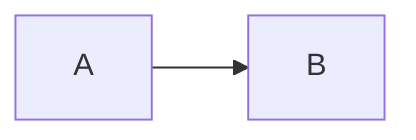
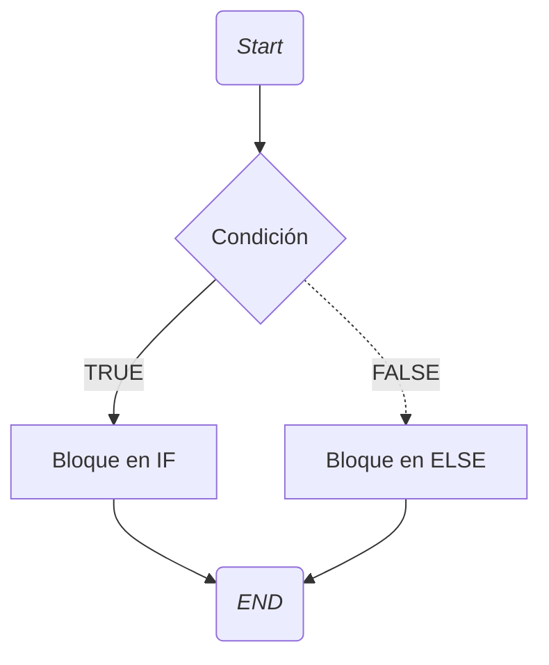
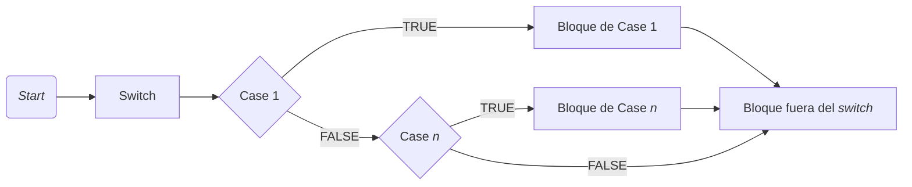
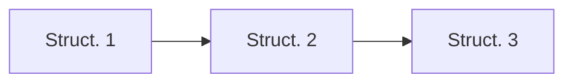
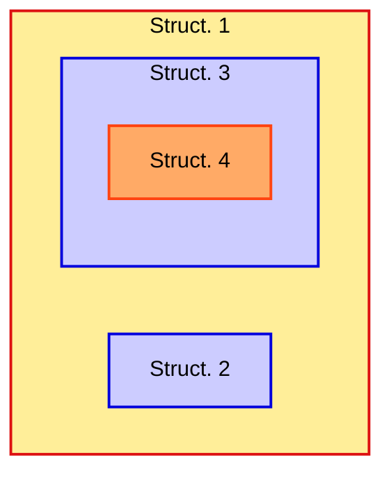
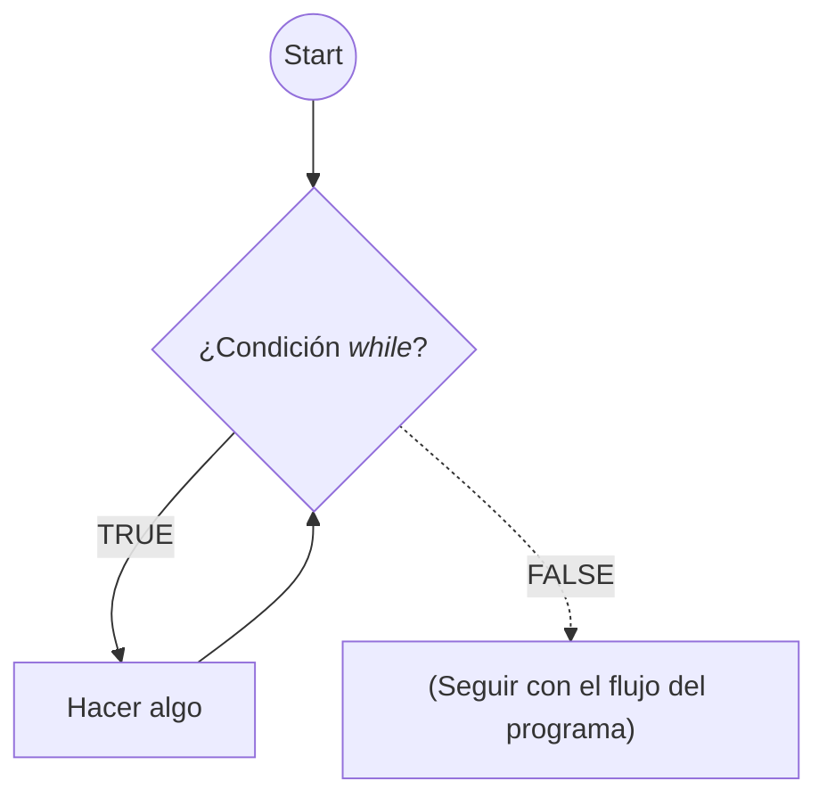
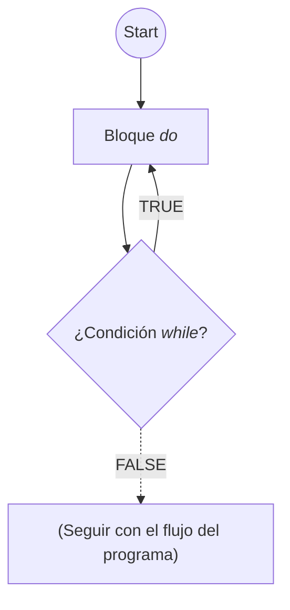
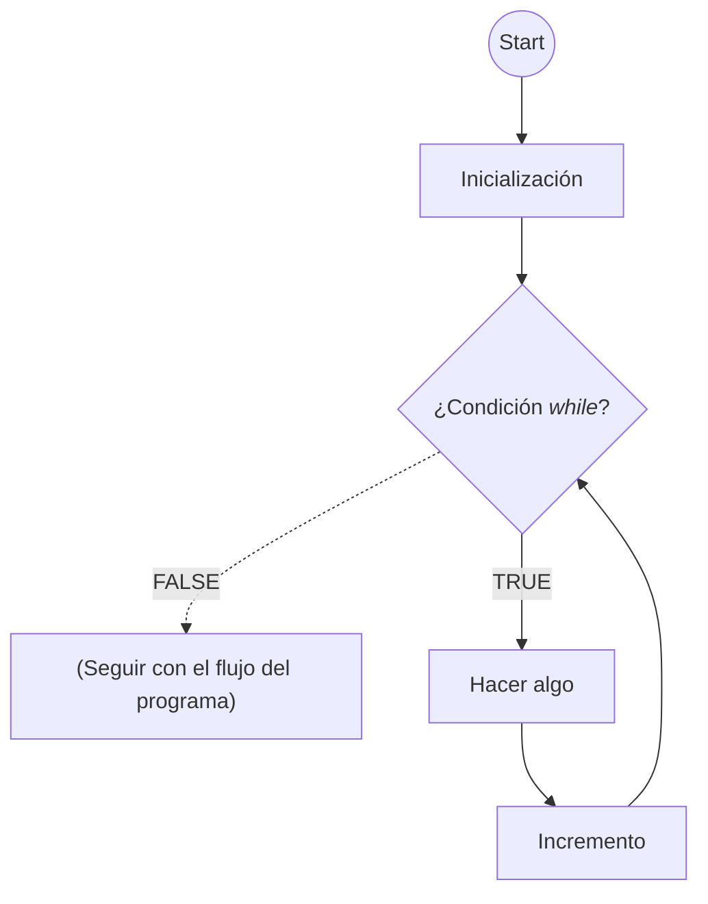

# Estructuras básicas de control y datos

**Teorema de estructura**: Todo programa con un único punto de entrada y un único punto de salida, cuyas sentencias se alcancen todas en algún momento y que no posea bucles  infinitos (programa propio) se puede construir con tres constructores elementales: **secuencia**, **selección** y **bucle**.

## Estructuras de control elementales

### Secuencia

```java
int valor = 0;
valor = valor + 10;
System.out.println(valor);
```



### Selección

```java
if (condition) {
    // block of instructions...
}
else {
    // block of instructions...
}
```

- Otra opción es no emplear "else":

```java
if (condition) {
    // block of instructions...
}
```



<div align="center">

Si no usamos la sentencia `else`, en este diagrama de flujo simplemente no habría bloque en _ELSE_ y saltaríamos a _END_ directamente
</div>

> Consultar el ejemplo [Condition](/src/Unit3/Condition.java) , que detecta si un número es negativo o no

```java
if (max = MAXIMO_ENCONTRADO) { 
        System.out.println (max+ " es el máximo encontrado"); 
}
```

<div align="center">

Ejemplo de condición mal formulada: en la condición del `if` debe usarse el operador de comparación y no el de asignación
</div>

#### Operador ternario

```java
condición ? expresión1 : expresión2;

// Equivale al siguiente bloque

if (condición) { 
    expresión1;
}
else {
    expresion2;
}
```

Por ejemplo:

```java
mayor = (n1 < n2) ? n2 : n1;
```

<div align="center">
La variable <code>mayor</code> tomará el valor de <code>n2</code> si <code>n1 < n2</code>, si no, tomará el de <code>n1</code>
</div>

#### Selección múltiple

```java
switch (expresión) {
    case literal 1: 
        // Bloque 1
        break;
    case literal 2: 
        // Bloque 2
        break;
    ...
    default:
        // Bloque n
}
```

---

```java
if (opcion == 'u') 
  x = x + 1; 
else
  if (opcion == 'd') 
    x = x + 2; 
  else 
    if (opcion == 't') 
      x = x + 3; 
    else 
      x = x + 4;

// El equivalente en switch-case es...

switch (opcion) {
    case 'u':
        x = x + 1;
        break;
    case 'd':
        x = x + 2;
        break;
    case 't':
        x = x + 3;
        break;
    default:
        x = x + 4;
        break;
    }
```

---

La expresión debe producir un valor de tipo `int`, `char` o `String` y el _literal_ debe ser del **mismo tipo** que el resultado de la expresión.



```java
import java.util.*;
class Switch {
    public static void main(String [] args){
        int number ;
        Scanner leer = new Scanner (System.in);
        // Reading Data
        System.out.print("Insert an integer: ");
        number = leer.nextInt();
        switch (number) {
            case 1:
                System.out.println("The number is 1");
                break;
            case 2:
                System.out.println("The number is 2");
                break;
            default:
                System.out.println("The number is neither 1 nor 2");
        } // End switch
    } // End of main method
} // End of class
```

#### Concatenación



```java
if (precio > 10.0) {
    precio = precio * 0.9; // Descuento 10%
}
if (cantidad > 5) {
    cantidad ++; // Un objeto gratis
}
```

#### Anidación



```java
if (precio > 10.0) {
    precio = precio * 0.9; // Descuento 10%
    if (precio > 20.0) {
        cantidad ++; // Un objeto gratis
    } // End internal if
} // End external if
```

### Bucles

#### `while`

- Condición al **principio**
- Se puede ejecutar **cero** veces

```java
while (condición) {
    // bloque de sentencias
}
```



```python
a = 1
while a < 10:
    print(a)
    a += 2
```

<pre>
1
3
5
7
9
</pre>

<div align="center">

Ejemplo básico de un bucle `while`
</div>

```java
class Counter {
    public static void main (String [] args) {
        final int END = 3;
        int i = 0, sum = 0;

        // Example of while loop controlled by counter
        while (i <= END) {
            System.out.print("Counter = " + i);
            sum = i + 2;
            System.out.println("Addition = " + sum);
            i = i + 1; // Increment of the counter (i)
        }
        
        System.out.println("Value of the counter out of loop=" + i);
        System.out.println("Final value of addition= " + sum);
    }
}
```

<div align="center">

Ejemplo "contador" con un `while`
</div>

#### `do-while`

- Condición al **final**
- Siempre se ejecuta **al menos una vez**

```java
do {
    // bloque de acciones
} while (condición);
```



```java
class Counter{
    public static void main (String [] args){
        final int END = 3;
        int i = 0, sum = 0;

        // Example of do-while loop controlled by a counter
        do {
            System.out.print("Counter = " + i);
            sum = i + 2;
            System.out.println("Addition= " + sum);
            i = i + 1; // Increment of counter (i)
        } while (i <= END);
        System.out.println("Value of the counter"
                            + " out of the loop = " + i);
        System.out.println("final value of sum = " + sum);
    } // End of main method
} // End of class Contador
```

<div align="center">

Ejemplo "contador" con un `do-while`
</div>

#### `for` (`while` controlado por contador)

```java
for (inicialización; condición; incremento) {
    // bloque de sentencias
}
```

- El incremento se realiza después de ejecutar el bloque de sentencias.

```java
inicialización;
while (condición) {
    // bloque de sentencias
    incremento;
}
```

<div align="center">

Código equivalente al tipo de bucle `for`
</div>



```java
class Contador {
    public static void main (String [] args) {
    final int END = 3;
    int i, sum = 0;

    // Example of for loop
    for(i = 0; i <= END; i++) {
        System.out.print("Counter = " + i);
        sum = i + 2;
        System.out.println("Sum = " + sum);
    }

    System.out.println("Value of the counter"
                        +" out of the loop = " + i);
    System.out.println("Final value of sum = " + sum);

    }

}
```

<div align="center">

Ejemplo "contador" con un `for`
</div>

```java
for (int i = 0; i <= END; i++) {
    System.out.println("Value of the counter: " + i);
}
```
<div align="center">

La variable contadora se puede declarar en el `for`. En ese caso **sólo** existe dentro del mismo.
</div>

```java
int counter = 1;
final int LIMIT = 25;
while (counter <= LIMIT) {
    System.out.println(counter);
    counter = counter - 1;
}

...

while (true) {
    // Bloque de código que se ejecutará infinitamente
}
```

<div align="center">

Posibilidad de bucles infinitos (la condición siempre es verdadera)
</div>

### Estructuras de datos: **Array**

En programación es habitual que se necesiten muchos elementos del mismo tipo, entonces, los lenguajes de programación —Java incluido— proporcionan un mecanismo para  manejarlos como un conjunto, con un identificador único para el conjunto. Por ello, un **array** representa:

- Una de esta **colección** de elementos del mismo tipo organizados según algún criterio
- Una organización definida por uno o varios **índices**. Estos índices permiten _señalar_ un elemento específico.
- Dependiendo del **número** de índices, la estructura será **unidimensional** o **multidimensional**.

Los elementos se distinguen mediante un índice:

<div align="center">

|Tipo de array|Elemento(s)|Distribución|
|:---|:---:|:---|
|Array unidimensional|$a_0, a_1,\dots, a_n$|`i=0, n`|
|Array unidimensional|$a_{ij}$|`i=0, n`<br>`j=0, m`|
|Array unidimensional|$a_{ijk}$|`i=0, n`<br>`j=0, m`<br>`k=0, l`|

</div>

Otras propiedades que tienen los _arrays_ de Java:

- La enumeración de los índices comienza en **cero**. Entonces, si un array tiene `n` elementos el **rango** de los índices es _`[0, n-1]`_.
- Son **objetos**. Los elementos almacenados pueden ser de **diferentes tipos**: `int`, `double`, etc., incluso _objetos_, sin embargo, todos ellos deben ser del **mismo** tipo.

```java
type [] array_name = new type [array_length];
// Ejemplo de array unidimensional con capacidad para 20 enteros
int [] results = new int [20];
```
>:information_source: Java inicializará el array `results` con ceros

- Se permite definir una referencia **vacía**:

```java
type [] name = null;
```

- Es posible inicializar un _array_ en "varios pasos":

```java
type[] array_name;
array_name = new tipo [array_length];
```

- Invocar a una posición o **elemento específico**:

```java
results[3] //Llamará al cuarto elemento, el primero es 0
```

- Conocer la **longitud** (tamaño del array):

```java
int longitud = lista.length;
```

> :warning: **NO** confundir con `length()`, método usado por objetos `String`

- Utilizar una lista de elementos para crear e inicializar un array:

```java
tipo [] nombre_array = {lista de elementos separados por comas};
// Ejemplo con enteros
int [] valores = {22, 56, 1, 39, 88};
```

- Ejemplo de modelaje de una sala de un cine, considerando que se debe conocer si una butaca está ocupada o no. Por ejemplo, sabemos que las columnas van del 1 al 11 (izquierda a derecha), y las filas del 1 (más cercana) al 8 (más al fondo):

```java
boolean [][] salaCine;
salaCine = new boolean [8][11];
```

---

```java
class MatricesA {
    public static void main(String [ ] args) {
        final int LIMIT = 5; // Vector's dimension
        int [] list = new int [LIMIT];

        for (int i = 0; i < LIMIT; i++) {   // Initialization
            list[i] = 10 * i;
        }

        for (int i = 0; i < LIMIT; i++) {   // Writing the vector
            System.out.print(list[i] + " ");
        }

    } // End method
} // End class
```

<div align="center">

Ejemplo de uso de matrices 1. El espacio en memoria para el _array_ es asignado de forma **estática**<br>(en tiempo de compilación)

</div>

```java
import java.util.*;
class MatricesB {
    public static void main (String [ ] args) {
        int limit;
        Scanner scan = new Scanner (System.in);
        limit = scan.nextInt();  // Read the length
        int [] list = new int [limit];

        // Initializating and writing within the array
        for (int i = 0; i < limit; i++) {
            list[i] = 10*i;
            System.out.print(list[i] + " ");
        }
    } // End method
} // End class
```

<div align="center">

Ejemplo de uso de matrices 2. El espacio en memoria para el _array_ es asignado de forma **dinámica**<br>(en tiempo de ejecución, la longitud es pedida por teclado)

</div>

#### ArrayOutOfBoundsException

Un índice no puede **apuntar** a un elemento cuyo índice está **fuera** de los límites de la matriz. En Java se lanza la excepción `ArrayOutOfBoundsException`:

```java
int [] ejemplo = new int [2];
System.out.println("Valor: " + ejemplo[2]); // ERROR
```

#### Matrices multidimensionales

Los arrays multidimensionales son **arrays de arrays**.

```java
int [][] dosD = new int [4][5]; // Array bidimensional
```


```java
class MatricesMulti {
    public static void main(String[] args) {
        int [][] tabla = {{1}, {2, 3}, {4, 5, 6}, {7, 8, 9, 10}};
        int suma;
        for (int i = 0; i < tabla.length; i++) { // For rows
            for (int j = 0; j < tabla[i].length; j++) { // For columns
                System.out.print (tabla[i][j] + " ") ;
            }
            System.out.println();
        }

        // Adding rows and printing the result
        for (int i = 0; i < tabla.length; i++) {
            suma = 0;
            for (int j = 0; j < tabla[i].length; j++) {
                suma += tabla[i][j];
            }
            System.out.println("Row: " + (i + 1) + "  addition: " + suma);
        }
    } // End method
} // End class
```

<div align="center">

Ejemplo de uso de matrices 3. Inicialización con una lista y uso de la constante longitud para controlar el acceso a todos los elementos
</div>

<pre>
1 
2 3 
4 5 6 
7 8 9 10 
Row: 1  addition: 1
Row: 2  addition: 5
Row: 3  addition: 15
Row: 4  addition: 34
</pre>