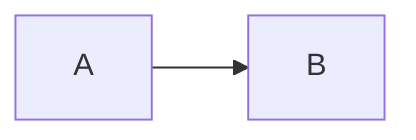
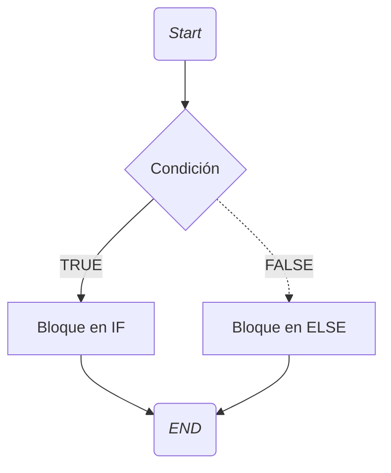
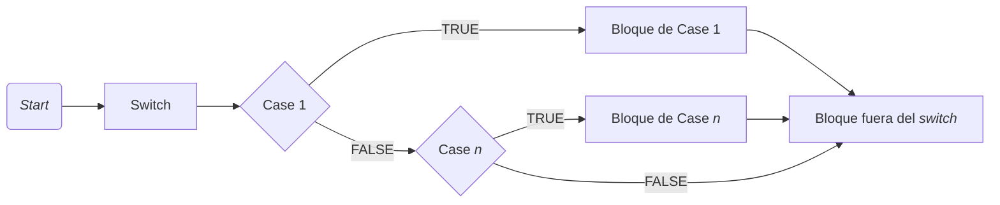
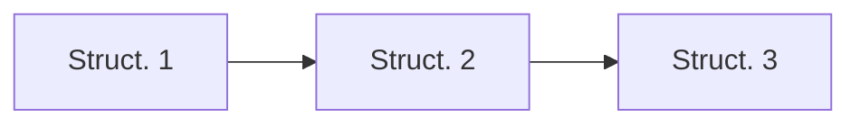
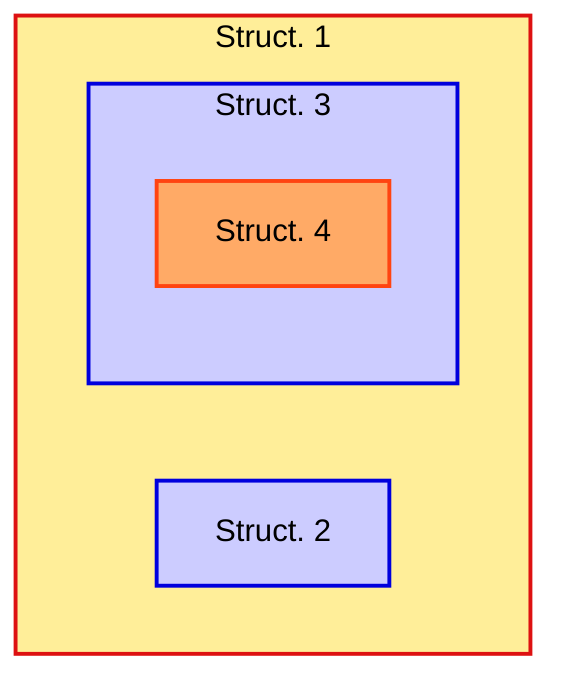
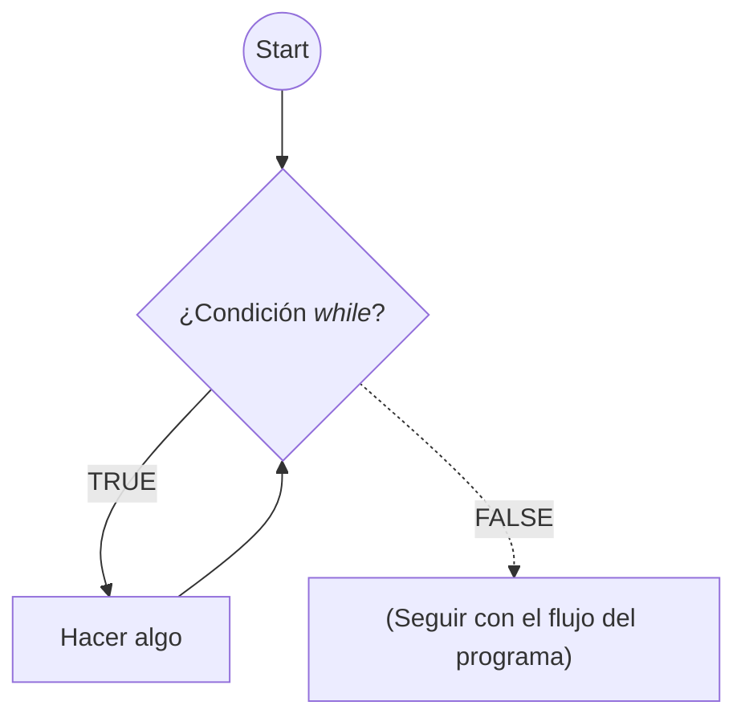
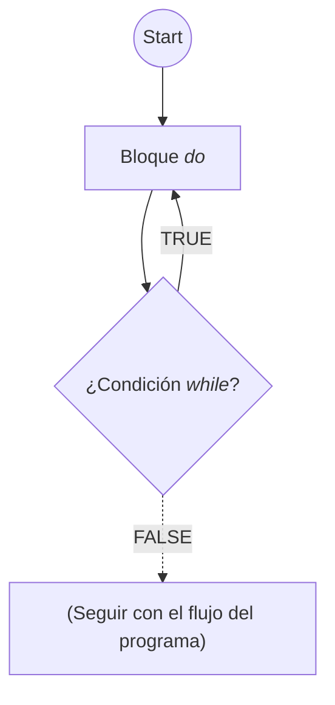
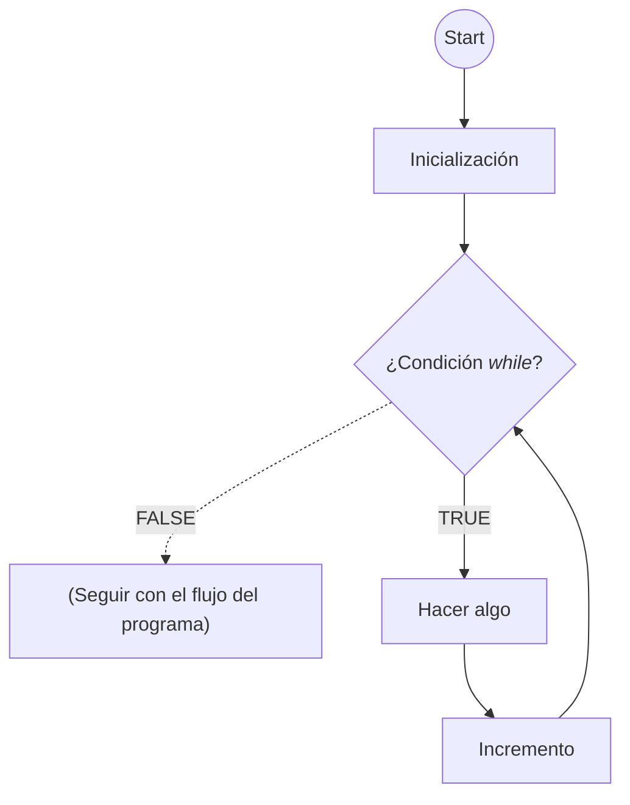

# Estructuras básicas de control y datos

**Teorema de estructura**: Todo programa con un único punto de entrada y un único punto de salida, cuyas sentencias se alcancen todas en algún momento y que no posea bucles  infinitos (programa propio) se puede construir con tres constructores elementales: **secuencia**, **selección** y **bucle**.

## Estructuras de control elementales

### Secuencia

```java
int valor = 0;
valor = valor + 10;
System.out.println(valor);
```



### Selección

```java
if (condition) {
    // block of instructions...
}
else {
    // block of instructions...
}
```

- Otra opción es no emplear "else":

```java
if (condition) {
    // block of instructions...
}
```



<div align="center">
Si no usamos la sentencia <code>else</code>, en este diagrama de flujo simplemente no habría bloque en <code>ELSE</code> y saltaríamos a <code>END</code> directamente
</div>

<p>
</p>

```java
import java.util.*;
class Condition {
// Example of conditional instruction if-else
    public static void main(String[] args) {
        int x;
        Scanner leer = new Scanner(System.in);

        // Reading data
        System.out.println("Insert an integer");
        x = leer.nextInt();
        System.out.println("Integer written" + x);
        // Using the condition
        if (x < 0) {
            System.out.println("The number is negative");
        } // End of "true" (if) branch
        else {
            System.out.println("The number is positive");
        } // End of else
        System.out.println("End of program");
    } // End of main method
} // End of class Condition
```

<div align="center">
Ejemplo de uso de <code>if-else</code> para detectar si un número es negativo o no
</div>

#### Operador ternario

```java
condición ? expresión1 : expresión2;

// Equivale al siguiente bloque

if (condición) { 
    expresión1;
}
else {
    expresion2;
}
```

Por ejemplo:

```java
mayor = (n1 < n2) ? n2 : n1;
```

<div align="center">
La variable <code>mayor</code> tomará el valor de <code>n2</code> si <code>n1 < n2</code>, si no, tomará el de <code>n1</code>
</div>

#### Selección múltiple

```java
switch (expresión) {
    case literal 1: 
        // Bloque 1
        break;
    case literal 2: 
        // Bloque 2
        break;
    ...
    default:
        // Bloque n
}
```

La expresión debe producir un valor de tipo `int`, `char` o `String` y el _literal_ debe ser del **mismo tipo** que el resultado de la expresión.



```java
import java.util.*;
class Switch {
    public static void main(String [] args){
        int number ;
        Scanner leer = new Scanner (System.in);
        // Reading Data
        System.out.print("Insert an integer: ");
        number = leer.nextInt();
        switch (number) {
            case 1:
                System.out.println("The number is 1");
                break;
            case 2:
                System.out.println("The number is 2");
                break;
            default:
                System.out.println("The number is neither 1 nor 2");
        } // End switch
    } // End of main method
} // End of class
```

#### Concatenación



```java
if (precio > 10.0) {
    precio = precio * 0.9; // Descuento 10%
}
if (cantidad > 5) {
    cantidad ++; // Un objeto gratis
}
```

#### Anidación



```java
if (precio > 10.0) {
    precio = precio * 0.9; // Descuento 10%
    if (precio > 20.0) {
        cantidad ++; // Un objeto gratis
    } // End internal if
} // End external if
```

### Bucles

#### `while`

- Condición al **principio**
- Se puede ejecutar **cero** veces

```java
while (condición) {
    // bloque de sentencias
}
```



```python
a = 1
while a < 10:
    print(a)
    a += 2
```

<pre>
1
3
5
7
9
</pre>

<div align="center">

Ejemplo básico de un bucle `while`
</div>

```java
class Counter {
    public static void main (String [] args) {
        final int END = 3;
        int i = 0, sum = 0;

        // Example of while loop controlled by counter
        while (i <= END) {
            System.out.print("Counter = " + i);
            sum = i + 2;
            System.out.println("Addition = " + sum);
            i = i + 1; // Increment of the counter (i)
        }
        
        System.out.println("Value of the counter out of loop=" + i);
        System.out.println("Final value of addition= " + sum);
    }
}
```

<div align="center">

Ejemplo "contador" con un `while`
</div>

#### `do-while`

- Condición al **final**
- Siempre se ejecuta **al menos una vez**

```java
do {
    // bloque de acciones
} while (condición);
```



```java
class Counter{
    public static void main (String [] args){
        final int END = 3;
        int i = 0, sum = 0;

        // Example of do-while loop controlled by a counter
        do {
            System.out.print("Counter = " + i);
            sum = i + 2;
            System.out.println("Addition= " + sum);
            i = i + 1; // Increment of counter (i)
        } while (i <= END);
        System.out.println("Value of the counter"
                            + " out of the loop = " + i);
        System.out.println("final value of sum = " + sum);
    } // End of main method
} // End of class Contador
```

<div align="center">

Ejemplo "contador" con un `do-while`
</div>

#### `for` (`while` controlado por contador)

```java
for (inicialización; condición; incremento) {
    // bloque de sentencias
}
```

- El incremento se realiza después de ejecutar el bloque de sentencias.

```java
inicialización;
while (condición) {
    // bloque de sentencias
    incremento;
}
```

<div align="center">

Código equivalente al tipo de bucle `for`
</div>



```java
class Contador {
    public static void main (String [] args) {
    final int END = 3;
    int i, sum = 0;

    // Example of for loop
    for(i = 0; i <= END; i++) {
        System.out.print("Counter = " + i);
        sum = i + 2;
        System.out.println("Sum = " + sum);
    }

    System.out.println("Value of the counter"
                        +" out of the loop = " + i);
    System.out.println("Final value of sum = " + sum);

    }

}
```

<div align="center">

Ejemplo "contador" con un `for`
</div>

```java
for (int i = 0; i <= END; i++) {
    System.out.println("Value of the counter: " + i);
}
```
<div align="center">

La variable contadora se puede declarar en el `for`. En ese caso **sólo** existe dentro del mismo.
</div>

```java
int counter = 1;
final int LIMIT = 25;
while (counter <= LIMIT) {
    System.out.println(counter);
    counter = counter - 1;
}

...

while (true) {
    // Bloque de código que se ejecutará infinitamente
}
```

<div align="center">

Posibilidad de bucles infinitos (la condición siempre es verdadera)
</div>

### Estructuras de datos: **Array**

En programación es habitual que se necesiten muchos elementos del mismo tipo, entonces, los lenguajes de programación —Java incluido— proporcionan un mecanismo para  manejarlos como un conjunto, con un identificador único para el conjunto. Por ello, un **array** representa:

- Una de esta **colección** de elementos del mismo tipo organizados según algún criterio
- Una organización definida por uno o varios **índices**. Estos índices permiten _señalar_ un elemento específico.
- Dependiendo del **número** de índices, la estructura será **unidimensional** o **multidimensional**.

