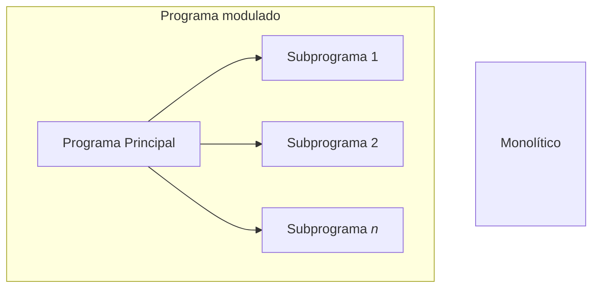
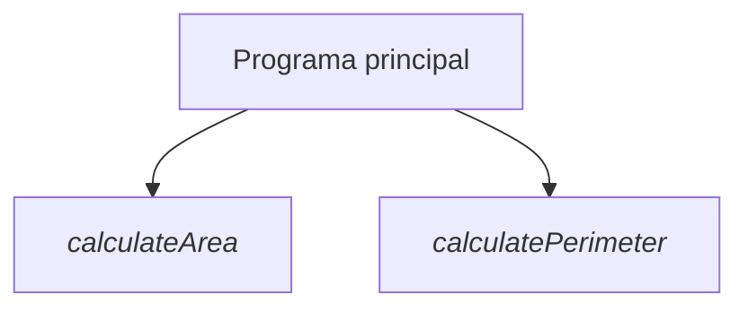
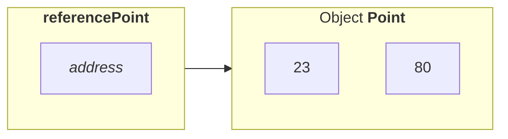

# Programación modular. Ficheros

Cuando un problema es complejo puede dividirse en varios subproblemas más pequeños, son más fáciles de entender y resolver. Entonces, al unir las soluciones de los subproblemas se obtiene la solución del problema completo.

> Este enfoque de resolución de problemas se conoce como "divide y vencerás"

La programación modular es un enfoque de diseño de programas en el que la funcionalidad del programa se **divide** en varios **módulos** de programa independientes. Los módulos pueden ser llamados dentro del programa tantas veces como sea necesario y reutilizados en otros programas.



<div align="center">

Por ejemplo, un módulo puede ser para la entrada de datos, otro para el procesado y otro para la salida del programa
</div>

## Modularización funcional

Un **subprograma** es un bloque de instrucciones, identificado por un nombre, que puede ser invocado por otros programas o subprogramas. Representa una instrucción abstracta (función), que implementa una **tarea específica**.

La especificación de un subprograma se compone de:

- El nombre del subprograma
- La cabecera: nombre y número de parámetros formales, su orden y tipos, así como el número de resultados, su orden y tipos 
- Una descripción de la función implementada

De esta manera, es posible entender la funcionalidad del subprograma sin ver su implementación, y entre sus ventajas destacan:

1. Permite ocultar información
2. **Simplifica** el mantenimiento y la depuración de errores
3. Simplifica la abstracción procedimental
4. Favorece la **reutilización** del código
5. Evita la **repetición** del mismo código varias veces (dentro de un programa)

### Funciones. Procedimientos. Métodos

- Si un subprograma devuelve explícitamente un **único** valor, se denomina _función_
- Se denominan subrutina o _procedimiento_ si devuelven **más** de un valor (o incluso ninguno, depende del lenguaje...)

Pero en general, en los lenguajes orientados a objetos, los subprogramas se llaman **métodos**, y tienen una serie de tipos de **parámetros**:

- De **entrada**: Proporciona un dato que si se modifica dentro del subprograma **no** se modifica en el programa
- _Entrada/salida_: Proporciona un dato que si se modifica en el subprograma **también** se modifica en el programa.
- **Salida**: Representa un **resultado** del subprograma

<!--
- Un subprograma puede tener "parámetros implícitos" como variables no locales que se utilizan dentro del programa
- Un programa puede tener "resultados implícitos" (efectos secundarios) representados como modificaciones de variables no locales o parámetros in-out
- El comportamiento de un subprograma puede ser indefinido para algunos parámetros: fin anormal de un programa
- Los resultados de un programa pueden depender de su propia historia: falta de transparencia referencial
-->

```java
<modifiers> <return_type> method_identifier (<type> parameter_1, ..., <type> parameter_n) {
    // Bloque de código
}
```

<div align="center">

La sintaxis de un método en Java
</div>

En cuanto a la sintaxis...

- **Modificador** (`modifiers`): Los métodos que definiremos son métodos de clase (_todavía_ no trabajamos con objetos), por lo que _por el momento_ el modificador será `static`
- **Tipo de retorno** (`return_type`): Puede ser un tipo de dato primitivo o una clase. Si un método no devuelve nada el tipo es "void"
- **Identificador** (`method_identifier`): nombre del método
- **Parámetros** formales: lista con el tipo de datos y los nombres de los parámetros de entrada

#### Consideraciones

```java
class Example {
    modifiers method1() {
        // code of method 1
    }
    ...
    modifiers methodN() {
        // code of method N
    }
    public static void main (String[] args) {
        // code of method main
    }
}
```

- No existen los métodos anidados
- Sólo existe un único metodo principal (main)
- Puedes crear tantos métodos como necesites

---

```java
int method1 (int x, float y){
    // local variables and data structures definition ---
    // block of instructions defining the task of the method---
    return result;
}
```

<div align="center">

La estructura de un subprograma en Java. Es importante que en caso de que si el tipo a devolver es primitivo, debe **existir** una expresión de retorno (instrucción `return` que finaliza el método). En este caso, el tipo de la expresión debe **coincidir** con el tipo de retorno de la cabecera; si no devuelve nada, será `void`.
</div>

---



<div align="center">

Representación de la estructura modular de [Circle.java](/src/Unit4/Circle.java) diagramas de estructura. Cada bloque calcula una tarea (cohesión), y en cada uno se puede ver el **alcance** de las variables: variables locales y globales, efectos secundarios...
</div>

## Variables locales y globales

- **Variables globales**. Son las que son definidas en el cuerpo de la **clase** —por ejemplo, al principio de esta. Esto permite que sean **accesibles desde cualquier parte del programa** y pueden ser utilizadas dentro de cada subprograma
    - _Desventaja_: Efectos secundarios
- **Variables locales**. Son las que definimos **dentro** de algún método, ya sea en el `main()` o cualquier otro.
    - Si se definen al principio del método son accesibles en todo el método
    - Si se definen dentro de una estructura (`if`, `while`...), sólo son accesibles en dicho bloque

```java
Class Prueba {
    static int global = 1; // variable global
    public static void main(String[] args) {
        metodo_1();
        System.out.println("In main:" + global);
    }

    public static void metodo_1() {
        global++;
    System.out.println("Inside method: " + global);
    }
}
```

## Paso de parámetros

Hasta ahora, las variables nos han sido útiles de tal forma que varios programas puedan compartir los mismos datos, y posibles modificaciones se mantengan en el tiempo. Sin embargo, si somos capaces de compartir estos valores mediante **parámetros**, será más útil para trabajar con _subprogramas_.

> Los parámetros podrían explicarse como los datos **necesarios** para la ejecución de un método, y que son accesibles en todo el bloque de dicho método

### Formales

Parámetros en la cabecera del subprograma. Se pueden considerar como variables locales (son incluso más que eso)

```java
float miFuncion(float x, int y) {
    //...
}
```

>:warning: **No pueden existir dos métodos iguales**, pero sí dos métodos con el mismo nombre, siempre y cuando los parámetros no sean los mismos, de lo contrario la _firma_ sería la misma, es decir, **incompatibles**.
> 
> ```java
> // Considerando como ejemplo:
> public static float miFuncion(float x, int y);
> // Este es incompatible: ya existe "miFuncion" con los mismos args.:
> public static double miFuncion(float x, int y);
> // Sin embargo, este sí se permite:
> public static double miFuncion(double z);
> ```

### Actuales o Reales

Son como tal los datos transmitidos al subprograma al invocarlo:

```java
miFuncion(2*z, 3);
```

Un parámetro real —más habitualmente llamado **argumento**— puede ser cualquier expresión válida:

- Datos locales
- Datos globales
- Todos los datos devueltos por un subprograma
- ...

En Java, la relación entre los parámetros formales y reales es por posición relativa:

```java
miFuncion(2*z, 3);
float miFuncion(float x, int y);
```

<div align="center">

`2*z` será `x` (es el 1er argumento) y `3` será `y` (es el 2do argumento)
</div>

> En otros lenguajes de programación también se pueden asociar por _coincidencia por nominación explícita_: cada nombre de parámetro formal se asocia con el parámetro real:
> ```
> myFunction(y=>3, x=>2*z)
> ```

### Formas de pasar los parámetros

#### Por valor

El valor real se evalúa y se **copia** en el parámetro formal, de esta manera, funcionan como variables locales, con el matiz que cualquier modificación sobre estas se **pierde** tras finalizar el método.

- La más fácil e ineficiente, en términos de tiempo y memoria
- Java implementa este tipo de paso de parámetros, al igual que muchos otros

La forma en la que los parámetros se pasan por valor siguen la siguiente regla. Considerando la siguiente asignación...

```java
Point referencePoint = new Point(23, 80);
```



<div align="center">

Las variables en Java no contienen objetos, sino referencias a objetos
</div>

#### Por referencia

El parámetro formal se inicializa con la dirección del _dato almacenado en_ el parámetro real. El paso de parámetros por referencia funciona de la siguiente forma:

1) Tenemos un subprograma que llama a otro subprograma, se analiza cada parámetro real de la llamada al programa, obteniendo una **lista de punteros** (_direcciones de memoria donde están los parámetros analizados_)
2) El subprograma llamado toma el relevo y se genera el _registro de activación_
3) En el programa llamado, mediante los punteros, podemos _acceder_ a los valores de los parámetros reales y _modificar_ sus valores
4) Cuando el subprograma termina, las modificaciones quedan para el subprograma llamado

>:information_source: En Java el paso de parámetros es siempre por valor, y nunca por referencia: los tipos _básicos_ simplemente hace una **copia de ellos** y los _objetos_ lo que hace es una **copia de la referencia**:
> 
> - Se pasa una copia del valor de la variable, que es la dirección (referencia) del objeto
> - Al finalizar el subprograma, la referencia no habrá cambiado. El parámetro sigue refiriéndose al mismo objeto
> -  Sin embargo, los valores dentro del objeto referenciado pueden haber cambiado

#### Sobrecarga de métodos

Algunos lenguajes, entre otros Java, permiten _utilizar el mismo identificador de un método para otros métodos_. La diferencia vendrá por la lista de parámetros, utilizando un número diferente de argumentos o diferentes tipos de datos. **El nombre del método junto con el tipo, orden y número de parámetros es la "firma del método"**.

Para considerar la sobrecarga de métodos, es necesario utilizar el mismo nombre y tipo de retorno para todos los métodos (que **NO** forma parte de la firma), pero diferente tipo y/o número de parámetros.

```java
int method_1(int variable_1)
int method_1(double variable_1)
int method_1(int variable_1, double variable_2)
int method_1(double variable_2, int variable_1)
    ...
double method_1(int variable_1)
// Erróneo con el 1º (tipo de retorno cambiado) pero correcto con el 2º al ser argumentos diferentes
```

> Este aspecto es interesante ya que nos permite repetir la misma tarea utilizando diferentes tipos de datos

## Ficheros

Un fichero es un conjunto de registros compuesto por campos que almacenan información diversa (datos estructurados). Por ejemplo, los diferentes datos de un empleado de una empresa podrían representar los campos de un registro:

<div align="center">

|Campo|¿Posible tipo?|
|----:|:--|
|ID|`int`|
|Nombre|`String`|
|Dirección|`String`|
|Número de teléfono|`int` ó `String`|
|Categoría|`char`|
|Salario|`double`|

</div>

### Clasificación de ficheros

#### Soporte físico

Como los ficheros se implementan sobre memoria secundaria, el tipo de  fichero está relacionado con el **soporte físico** sobre el que se implementan (dónde se graban o almacenan los datos):

- **Soportes secuenciales**. La información se almacena consecutivamente, es decir, para acceder a un elemento $n$, se requiere pasar por los $n-1$ elementos anteriores
- **Soportes direccionables**. Permite un acceso directo a una posición de memoria dada. En estos soportes, los registros deben poseer un campo clave que los diferencie del resto de los registros del fichero.

#### Organización

Define la forma en que los registros se disponen sobre el soporte de almacenamiento  o la forma en la que se estructuran los datos en un fichero. **Se decide cuando se diseña el fichero**.

- **Organización secuencial**. Los registros se graban consecutivamente  cuando se crea el fichero y se debe acceder consecutivamente cuando se leen dichos registros. El orden físico en que fueron grabados (escritos) los registros es el orden de lectura de los mismos.
- **Organización directa**. El acceso a los registros se hace directamente a través de su posición (lugar relativo que ocupan), no de su orden "lógico". En esta forma de organización podemos leer y escribir en cualquier orden
- **Organización secuencial indexada**. La información está organizada con ayuda de dos ficheros:
    - Fichero de datos o registros, contiene la información total ordenada de acuerdo a un campo clave.
    - El de índices, que es de organización secuencial

#### Formato

Podemos clasificar los ficheros en función del formato usado para almacenar la información en ellos.

- **Ficheros binarios**. Su contenido son secuencias de dígitos binarios. Los ficheros binarios *se diseñan para que se lean desde un programa*, pero no pueden leerse directamente con un editor de texto.
- **Ficheros de texto**. Su contenido son una secuencia de caracteres y pueden, por lo tanto, ser leídos con un editor de texto.

|Texto|Binario|
|:---|:---|
|Puede trasladarse de un ordenador a otro|Dependiendo del ordenador, pueden leerse sólo en el mismo tipo de ordenador en el que se crearon|
|Pueden leerse utilizando cualquier editor, siendo inteligibles para personas|Sólo pueden ser leídos y escritos por un programa. Si editamos un fichero binario, es  imposible entender el texto|
|Los datos deben transformarse en bytes|Los datos se almacenan de la misma forma que en memoria primaria. Cada elemento se almacenado como una secuencia de bytes|
|Su coste computacional es mayor y, en consecuencia, más ineficiente|Se procesan deforma más eficiente porque los sistemas no tienen que convertir texto en bytes, que es lo que finalmente procesa el ordenador|

### Operaciones en los ficheros

- Creación
- Apertura
- Consulta
- Modificación
- Inserción
- Borrado
- Eliminación
- Clausura (cerrar)
- Movimiento (sobre el fichero)

### Ficheros en Java

**Java considera los archivos como _stream_ de bytes**. Cada fichero termina con un marcador de fichero (EOF) o bien en un número de byte específico registrado en una estructura de datos administrativa mantenida por el sistema. Java no requiere que los archivos tengan una  estructura, por lo que _el concepto de registro no existe_. Así, el programador debe estructurar los archivos desde el punto de vista lógico.

Clase **`File`**: clase auxiliar útil para trabajar con ficheros. No trabaja con flujos como la mayoría de las clases definidas en `java.io`. Trabaja directamente con archivos y el sistema de archivos.

Un objeto `File` se utiliza para obtener o modificar la información asociada a un archivo, por ejemplo, los permisos, la hora, la fecha o la carpeta, o para navegar a través de la jerarquía o las carpetas.

```java
File (String name)
```

Para utilizar la clase File, es necesario crear un objeto utilizando el constructor, y _name_ es el nombre de un archivo, incluyendo la ruta (por defecto el directorio de trabajo)

#### Algunos métodos

- `exists()`: devuelve _true_ si el nombre pasado como parámetro al constructor de la clase **File** es un archivo o directorio disponible en la ruta especificada. Devuelve _false_, en caso contrario
- `getName()`: devuelve un `String` con el nombre del archivo o directorio
- `length()`: devuelve un `long` que indica la longitud del archivo en _bytes_
- `delete()`: Elimina el archivo o directorio. Devuelve true si la eliminación se realizó como se esperaba, o false si falla

#### Leer/Escribir en/de un fichero

- **Leer**:

    ```java
    Scanner entrada;
    /* Dos maneras */
    entrada = new Scanner (new FileReader(name)); //Admite string
    entrada = new Scanner (name); // Objeto File
    ```

    Constructor podría arrojar `FileNotFoundException`

    - Métodos:

        - `close()`: Los ficheros después de usarlos siempre se cierran
        - `useLocale(Locale.US)` para alfabeto inglés, `Locale.ES` para español...
        - `next()` y `nextLine()`; `nextInt()`, `nextDouble()`, `nextFloat()`...
        - `hasNextInt()`, `hasNextDouble()`, `hasNextFloat()`, ...
            - Devolverá _true_ si el siguiente elemento del fichero puede ser leído como un `int`, `double`, `float`...

    - Ejemplo:

        ```java
        import java.util.*;
        import java.io.*;
        class ES {
            public static void main(String [] args) throws FileNotFoundException {
                Scanner sc = new Scanner(new FileReader("datos.txt"));
                sc.useLocale(Locale.US);
                System.out.print("insert a text: ");
                String cad1=sc.nextLine();
                System.out.print("insert a text with no blanks: ");
                String cad2=sc.next(); 
                System.out.print("insert a double: ");
                double d=sc.nextDouble();
                System.out.print("insert an integer: ");
                int i=sc.nextInt();
                ...
            }
        }
        ```

- **Escritura** secuencial (**Clase `PrintWriter`**):

    ```java
    PrintWriter salida;
    salida = new PrintWriter(new FileWriter(name));
    ```

    Constructor podría arrojar `IOException`

    - Métodos

        - `println()`
        - `print()`
        - `printf()`
        - `close()`. Cierra el fichero. Puede arrojar `IOException`