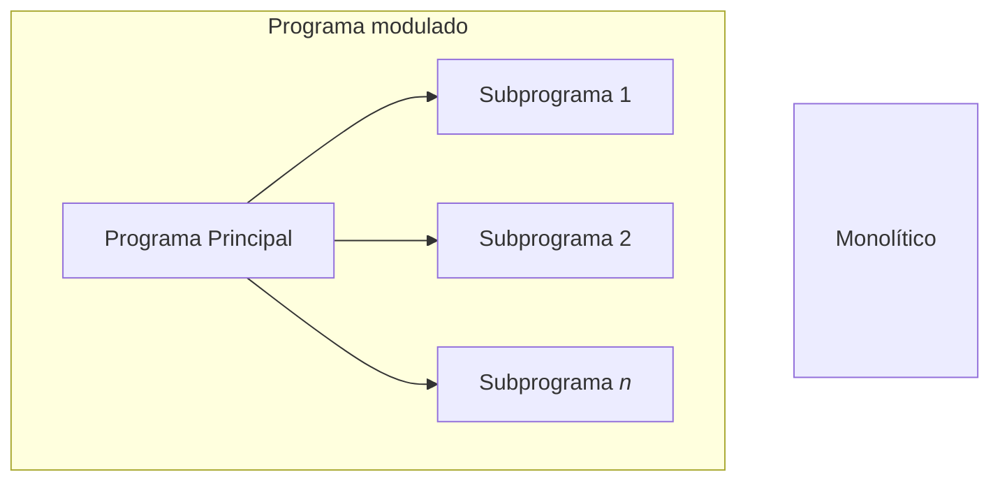
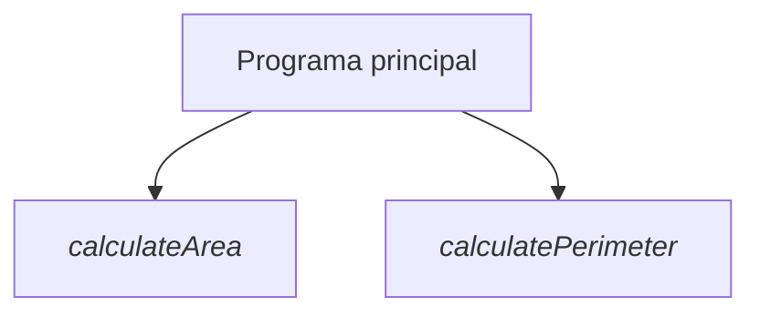

# Modular Programming. Files

Cuando un problema es complejo puede dividirse en varios subproblemas más pequeños, son más fáciles de entender y resolver. Entonces, al unir las soluciones de los subproblemas se obtiene la solución del problema completo.

> Este enfoque de resolución de problemas se conoce como "divide y vencerás"

La programación modular es un enfoque de diseño de programas en el que la funcionalidad del programa se **divide** en varios **módulos** de programa independientes. Los módulos pueden ser llamados dentro del programa tantas veces como sea necesario y reutilizados en otros programas.



<div align="center">

Por ejemplo, un módulo puede ser para la entrada de datos, otro para el procesado y otro para la salida del programa
</div>

## Modularización funcional

Un **subprograma** es un bloque de instrucciones, identificado por un nombre, que puede ser invocado por otros programas o subprogramas. Representa una instrucción abstracta (función), que implementa una **tarea específica**.

La especificación de un subprograma se compone de:

- El nombre del subprograma
- La cabecera: nombre y número de parámetros formales, su orden y tipos, así como el número de resultados, su orden y tipos 
- Una descripción de la función implementada

De esta manera, es posible entender la funcionalidad del subprograma sin ver su implementación, y entre sus ventajas destacan:

1. Permite ocultar información
2. **Simplifica** el mantenimiento y la depuración de errores
3. Simplifica la abstracción procedimental
4. Favorece la **reutilización** del código
5. Evita la **repetición** del mismo código varias veces (dentro de un programa)

### Funciones. Procedimientos. Métodos

- Si un subprograma devuelve explícitamente un **único** valor, se denomina _función_
- Se denominan subrutina o _procedimiento_ si devuelven **más** de un valor (o incluso ninguno, depende del lenguaje...)

Pero en general, en los lenguajes orientados a objetos, los subprogramas se llaman **métodos**, y tienen una serie de tipos de **parámetros**:

- De **entrada**: Proporciona un dato que si se modifica dentro del subprograma **no** se modifica en el programa
- _Entrada/salida_: Proporciona un dato que si se modifica en el subprograma **también** se modifica en el programa.
- **Salida**: Representa un **resultado** del subprograma

<!--
- Un subprograma puede tener "parámetros implícitos" como variables no locales que se utilizan dentro del programa
- Un programa puede tener "resultados implícitos" (efectos secundarios) representados como modificaciones de variables no locales o parámetros in-out
- El comportamiento de un subprograma puede ser indefinido para algunos parámetros: fin anormal de un programa
- Los resultados de un programa pueden depender de su propia historia: falta de transparencia referencial
-->

```java
<modifiers> <return_type> method_identifier (<type> parameter_1, ..., <type> parameter_n) {
    // Bloque de código
}
```

<div align="center">

La sintaxis de un método en Java
</div>

En cuanto a la sintaxis...

- **Modificador** (`modifiers`): Los métodos que definiremos son métodos de clase (_todavía_ no trabajamos con objetos), por lo que _por el momento_ el modificador será `static`
- **Tipo de retorno** (`return_type`): Puede ser un tipo de dato primitivo o una clase. Si un método no devuelve nada el tipo es "void"
- **Identificador** (`method_identifier`): nombre del método
- **Parámetros** formales: lista con el tipo de datos y los nombres de los parámetros de entrada

#### Consideraciones

```java
class Example {
    modifiers method1() {
        // code of method 1
    }
    ...
    modifiers methodN() {
        // code of method N
    }
    public static void main (String[] args) {
        // code of method main
    }
}
```

- No existen los métodos anidados
- Sólo existe un único metodo principal (main)
- Puedes crear tantos métodos como necesites

---

```java
int method1 (int x, float y){
    // local variables and data structures definition ---
    // block of instructions defining the task of the method---
    return result;
}
```

<div align="center">

La estructura de un subprograma en Java. Es importante que en caso de que si el tipo a devolver es primitivo, debe **existir** una expresión de retorno (instrucción `return` que finaliza el método). En este caso, el tipo de la expresión debe **coincidir** con el tipo de retorno de la cabecera; si no devuelve nada, será `void`.
</div>

---



<div align="center">

Representación de la estructura modular de [Circle.java](/src/Unit4/Circle.java) diagramas de estructura. Cada bloque calcula una tarea (cohesión), y en cada uno se puede ver el **alcance** de las variables: variables locales y globales, efectos secundarios...
</div>

## Variables locales y globales

- **Variables globales**: Accesibles desde cualquier parte del programa y pueden ser utilizadas dentro de cada subprograma
    - _Desventaja_: Efectos secundarios
- **Variables locales**