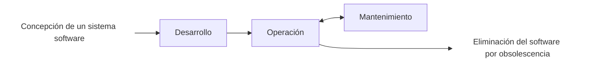

# Elementos de programación y lenguajes
- _Hardware_:
  - Representa los componentes físicos de la computadora

- _Software_:
  - Es el conjunto de programas utilizados por la computadora
    - _Software_ del sistema (sistema operativo y herramientas del sistema)
    - Aplicaciones

- Algoritmo:
  - Descripción precisa de los pasos necesarios para resolver un problema

- Instrucción:
  - Secuencia de símbolos que presenta una orden, que es ejecutada por la computadora

- **Programa**:
  - Conjunto de instrucciones, que define de forma precisa lo que debe realizar el ordenador
  - **Un programa se escribe utilizando un lenguaje de programación**

```java
class Begin{
  public static void main(String [ ] args) {
    System.out.println("Hola Mundo");
  } // End of main
} // End of class
```

## Lenguajes de programación
- Según el nivel de abstracción
  - Lenguajes de máquina
  - Lenguajes ensambladores
  - Lenguajes de alto nivel
  - Lenguajes de cuarta generación (4GL)

- Según el estilo de programación
  - Lenguajes imperativos/procedimentales
  - Lenguajes declarativos
  - Lenguajes funcionales
  - Lenguajes lógicos

- Según el modo de traducción
  - Lenguajes compilados
    - Toman el código fuente e inicia un _proceso de compilación_ para dar como resultado un código objeto
    - Otro proceso de enlazado (_linking process_) se encarga de buscar _librerías_/bibliotecas para generar un código binario o **ejecutable**
    
    ```mermaid
      flowchart TD
        H[Código fuente] -->|Proceso de compilación| I[Código objeto]
        I --> J[Código binario = Ejecutable]
        K[Librerías/Bibliotecas] -->|Enlazado| J
    ```
    
  - Lenguajes interpretados
    ```mermaid
      flowchart LR
        A[Código Fuente] -->|Compilación parcial| B[Ejecución]
        B ---> A
    ```
  - Lenguajes compilados-interpretados
    - Interpretación de Java
    ```mermaid
      flowchart LR
        A[Código Fuente Java] -->|Compilación| B[Bytecode]
        B --->|Interpretación| C[Lenguaje Máquina]
        C ---> B
    ```

## Estructura de un programa

- Estructura general
  ```mermaid
  flowchart LR
    A[Entrada] --> B[Procesado]
    B --> C[Salida]
  ```
- Arquitectura 3 capas
  ```mermaid
  flowchart LR
    A[Presentación] --> B[Dominio o aplicación]
    B --> C[Persistencia]
  ```
- Eficiencia y eficacia (_complejidad algorítmica_)
- Organización
  - Monolítica (el "todo"; no es óptimo)
  ```mermaid
  flowchart TD
    A[Programa principal] <--> B[Tarea 1]
    B --> F[Subtarea 1]
    B --> G[Subtarea 2]
    C[Entrada] --> A
    A ---> D[Salida]
  ```

## Errores en un programa

- Tipos de errores
  - De compilación
  - De ejecución (Runtime)
  - Lógicos

También denominados en la ciencia de la computación como **_bugs_**.

## Ingeniería de software. Pinceladas

Aplicación de un enfoque sistemático, disciplinado y cuantificable al desarrollo, operación y mantenimiento de software.


Donde el **Desarrollo** es:
  - Análisis
  - Diseño
  - Implementación
  - Pruebas

- Tipos de mantenimiento
  - Adaptativo
  - Correctivo
  - Preventivo
  - Perfectivo 