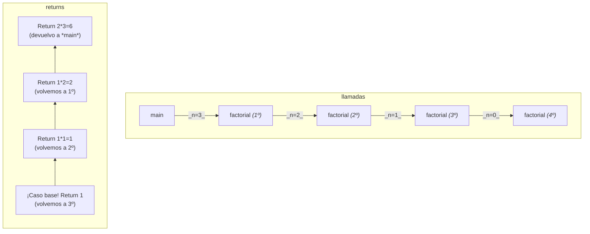
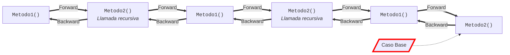

# Recursividad
La recursión es una potente técnica en la que un método se define parcialmente en términos de sí mismo, es decir, es una técnica para resolver problemas complejos que consiste en _reducir un problema en subproblemas, que mantienen la estructura del problema inicial pero son más fáciles de resolver_.
## Principio de inducción matemática
Es una técnica para probar un teorema, normalmente referido a números enteros. El principio se aplica en dos etapas:

1. Comprobamos que si el teorema se cumple para $N$ (hipótesis inductiva) se cumple también para $N+1$.
2. Comprobamos que el teorema se cumple para el primer valor posible. Si esto es así, por el apartado anterior será también válido para el segundo valor considerado y al serlo para éste también lo será para el tercero etc., lo que completa la demostración.

### Ejemplo de sumatorio

Para todo entero $N\geq 1$, la suma de los $N$ primeros enteros dada por

$$
\sum_{i=1}^{N}{i} = 1+2+3+\dots+N = \frac{N\times(N+1)}{2}
$$

#### Demostración

a) Hipótesis inductiva. Demostremos que si el teorema es válido para $N$ es válido para $N+1$:

$$
\sum_{i=1}^{N+1}{i} = \sum_{i=1}^{N}{i} + (N+1) = \frac{N\times(N+1)}{2} + (N+1) = \frac{(N+1)(N+2)}{2}\\~\\
\mathbf{Q.\ E.\ D}
$$

Si consideramos $N = 1$, y lo sustituimos en la primera fórmula, quedará $1(1+1)/2 = 1$, y si se lo ponemos a la segunda queda $(1+1)(1+2)/2 = 3$, que es exactamente el mismo resultado a si ponemos $2$, que en nuestro ejemplo es $N+1$: $2(2+1)/2 = 3$

**Se cumple para 1 y, por lo tanto, para 2 y, por lo tanto, para 3 etc...**

> Una prueba por inducción trabaja en dos etapas. Existe una en la que se demuestra que el teorema se cumple para el caso más pequeño, ésta se denomina caso base. Por otro lado, demostramos que si el teorema se cumple para un caso dado, se puede extender para incluir el caso siguiente, ésta es la  componente inductiva. La recursividad opera de forma análoga.

## Recursión elemental

**En programación la recursión se implementa como un método que se llama a sí mismo**. El método identifica los dos casos del principio de inducción. Es decir, _la recursión es una simulación del principio de inducción_.

### Caso base e inductivo

La recursión está relacionada con el principio de inducción:
- Por un lado, existe un _caso base_, sin llamadas inductivas. 
- Por otro, existe un _caso inductivo_ (también llamado **recursivo** o general), en el que _se llaman diferentes versiones del método_. Estas versiones reciben valores de parámetros más simples que llevan al caso base.

Entonces, se debe incluir un caso base para que se compruebe si es necesaria una llamada recursiva o si ya se alcanzó el caso base. Si nunca se alcanza el caso base, tenemos un problema: recursión infinita

Con el sumatorio, podemos definir un caso base `s(1)=1`:

$$
\sum_{i=1}^{1}i = 1
$$

Entonces, el caso inductivo (mientras que $n\geq 1$) es `s(n)=s(n-1)+n`

```java
import java.util.*;
class Recursion {
    public static void main(String [] args) {
        int n, sum;
        Scanner leer = new Scanner(System.in);
        n = leer.nextInt ();
        if (n > 0) {
        sum = s(n);
        System.out.println("Addition of the first "+ n +" integers:"+ sum);
        }
        else {
            System.out.println("The number cannot be < 1");
        } 
    } // End main
    public static int s(int n) {
        int value;
        if (n == 1) // Base case
            value = 1;
        else
            value = s(n - 1) + n; // Inductive case
        return value;
    } 
}
```

### Funcionamiento de la recursividad

Vamos a utilizar el problema del factorial para explicar el funcionamiento e implementación del proceso recursivo:

$$
N! = \prod_{i=1}^{N}i
$$

- Caso inductivo: $N! = N \times (N-1)!$
- Caso base: $0! = 1$

```java
class RecursiveFactorial {
    public static void main(String[] args) {
        int n;
        System.out.println("Recursive factorial\n");
        Scanner leer = new Scanner(System.in);
        n = leer.nextInt();
        if (n >= 0) {
            System.out.println("The factorial of " + n + " is:");
            System.out.println(factorial(n));
        } else
            System.out.println("It cannot be computed if n<0");
    } // End main

    public static long factorial(int n) {
        long nFact;
        /* Caso Base */
        if (n == 0) {
            nFact = 1;
        } else {
            /* Caso inductivo */
            nFact = factorial(n - 1) * n;
        }
        return nFact;
    }
}
```



<div align="center">

|Forward||Backward|
|:-:|:-:|:-|
|Llamada|_n_|Valor|
|1º|3|**6**|
|2º|2|2|
|3º|1|1|
|_4º (Caso Base)_|_0_|1|

</div>

#### Expresión general de un algoritmo recursivo

```
begin
    Recibir valor de la variable

    If (valor más bajo) Then:
        Caso Base
    Else:
        LLamar a método con un valor menor que el original
    End_If

    Return resultado
end
```

#### Comparación entre recursividad e iteración

|Analogías|Diferencias|
|:-------|:--|
|Ambos implican la repetición|El método está siendo llamado constantemente. _Este hecho supone un coste extra en términos de tiempo de cálculo y memoria_, ya que se definen nuevas variables para cada invocación. La diferencia en términos de eficiencia depende de cómo crece la pila de datos en el caso recursivo
|Ambos necesitan una forma de terminar|Todo problema resuelto por un enfoque recursivo puede ser resuelto también por un enfoque iterativo. Pero si este hecho es cierto, ¿por qué utilizar la recursión? La recursión se elige cuando la solución recursiva representa una solución más natural y el programa final es más fácil de entender y depurar y no excesivamente más ineficiente
|Ambos construyen gradualmente la solución|
|Ambos pueden continuar "infinitamente"|

### Tipos de recursión

- Recursión directa. Un método se llama a sí mismo. Es el caso de los ejemplos anteriores.
- Recursión indirecta. El método original es llamado después de llamar a otros métodos. Debe evitarse porque conlleva muchos problemas

